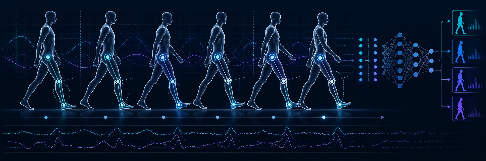

## Gait Based Person Identification Using Machine Learning

This repository contains the preprocessing, feature engineering, exploratory analysis, and gait-based person identification experiments conducted using flat-terrain walking trials.

The project focuses on organizing gait recordings into a reproducible dataset, extracting cycle-level features, and evaluating machine-learning models for person identification.

## Dataset Preparation

Only **flat-terrain (0,0) walking trials** were retained for this analysis.

Trial numbering follows the order of the original source folders within each participant. Each numbered trial folder represents one original recording, while the different processing phases belonging to that recording remain grouped together.

During dataset preparation:

- Empty source trials were excluded.
- Repeated angle datasets were removed.
- `Madhumini` was excluded because no eligible flat-terrain recordings were available.
- One retained trial for `Thenuri` is marked as having **device 9 missing**.
- Original source files were not modified.
- Copied file sizes were verified.
- All copied CSV files were additionally verified using **SHA-256 hashes**.

The complete mapping between the reorganized dataset and the original recordings is stored in:

```text
trial_manifest.json
```

The `Source` paths in this file intentionally refer to the original data collection locations so that provenance is preserved.

> Angle deduplication only identifies repeated angle datasets. It does not imply that all other sensor signals are identical, nor does it establish statistical independence between trials.

---

## Project Structure

```text
G&P/
│
├── data/
│   └── <participant>/
│       └── <trial>/
│           └── <processing phases and measurement CSVs>
│
├── analysis/
│   ├── 01_data_audit.ipynb
│   ├── 02_eda_patterns.ipynb
│   ├── 03_feature_engineering.ipynb
│   ├── 04_svm_evaluation.ipynb
│   ├── 05_pca_svm_model.ipynb
│   └── 00_results.ipynb
│
├── results/
│   ├── cycle_features_with_quality.csv
│   └── generated evaluation and comparison tables
│
├── trial_manifest.json
│
└── README.md
```

### `data/`

Contains the reorganized participant recordings while preserving the relationship between:

```text
participant → trial → processing phase
```

Measurement CSV files remain inside their corresponding participant and trial folders.

### `analysis/`

Contains the notebooks used for dataset validation, exploratory analysis, feature engineering, modelling, and final result interpretation.

### `results/`

Contains generated datasets and model evaluation outputs, including:

```text
cycle_features_with_quality.csv
```

and the CSV tables produced during model evaluation and feature-comparison experiments.

---

## Analysis Workflow

The notebooks are intended to be run in the following order:

```text
01_data_audit
      ↓
02_eda_patterns
      ↓
03_feature_engineering
      ↓
04_svm_evaluation
      ↓
05_pca_svm_model
      ↓
00_results
```

### 1. Data Audit

`01_data_audit.ipynb`

Checks the reorganized dataset structure, available participants, trials, phases, missing data, and other data-quality conditions.

### 2. Exploratory Data Analysis

`02_eda_patterns.ipynb`

Examines gait patterns, feature distributions, participant differences, trial-level behaviour, and general characteristics of the recordings.

### 3. Feature Engineering

`03_feature_engineering.ipynb`

Extracts cycle-level gait features and produces the modelling dataset:

```text
results/cycle_features_with_quality.csv
```

### 4. SVM Evaluation

`04_svm_evaluation.ipynb`

Evaluates gait-based person identification using a **Linear Support Vector Machine (SVM)** with trial-grouped evaluation.

Experiments include the full feature representation and feature-sensitivity analyses.

### 5. PCA + SVM

`05_pca_svm_model.ipynb`

Applies **Principal Component Analysis (PCA)** before Linear SVM classification to evaluate whether dimensionality can be reduced while maintaining identification performance.

### 6. Final Results

`00_results.ipynb`

Collects the main experimental results, comparisons, and final interpretation in one place.

---

## Running the Notebooks

The notebooks use project-relative paths rather than hard-coded machine-specific paths.

Each notebook begins with a setup cell that locates the project using:

```text
trial_manifest.json
```

and defines paths such as:

```python
PROJECT_ROOT
DATA_ROOT
RESULTS_DIR
```

Always run this setup cell before running the rest of a notebook.

The modelling notebooks read the feature dataset from:

```text
results/cycle_features_with_quality.csv
```

Generated result tables are written to:

```text
results/
```

using explicit project-relative paths.

### After Moving or Reorganizing Folders

If the project structure has been changed while a notebook kernel is still running:

1. Restart the Jupyter kernel.
2. Run the notebook again from the first cell.
3. Avoid using path variables remaining in memory from the previous folder structure.

Existing notebook outputs may display paths from earlier versions of the project. Rerunning the notebook refreshes these outputs using the current directory structure.

---

## Data Integrity and Provenance

The reorganization process was designed to preserve the original experimental data.

The following checks were performed:

- Original files were left unchanged.
- Copied file sizes were compared with their source files.
- CSV copies were verified using SHA-256 hashes.
- Original-to-reorganized trial mappings were recorded.
- Missing and excluded trials were documented.

The main provenance record is:

```text
trial_manifest.json
```

This allows each retained trial to be traced back to its original source recording.

---

## Notes on Trial Independence

Multiple gait cycles may originate from the same recording.

For this reason, model evaluation is performed at the **trial level rather than by randomly splitting individual gait cycles**. This reduces the risk of cycles from the same recording appearing in both the training and test sets and producing overly optimistic performance estimates.

---

## Main Modelling Approach

The current person-identification experiments evaluate:

```text
Gait cycle features
        ↓
Standardization
        ↓
Linear SVM
```

and:

```text
Gait cycle features
        ↓
Standardization
        ↓
PCA
        ↓
Linear SVM
```

The comparison is used to investigate how much feature dimensionality can be reduced while preserving gait-based identification performance.

---

## Reproducibility

To reproduce the analysis:

```text
1. Clone or download the repository.
2. Keep the existing project folder structure.
3. Open Jupyter from the project root or analysis/ directory.
4. Restart the notebook kernel if the project was recently moved.
5. Run the notebooks in the documented workflow order.
```

Do not move individual measurement CSV files outside their participant/trial folders unless the corresponding project paths and provenance records are also updated.

<p align="center">
  
</p>
